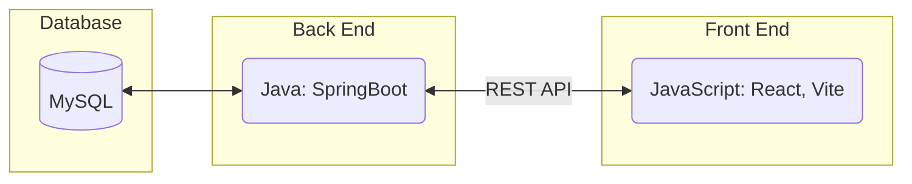
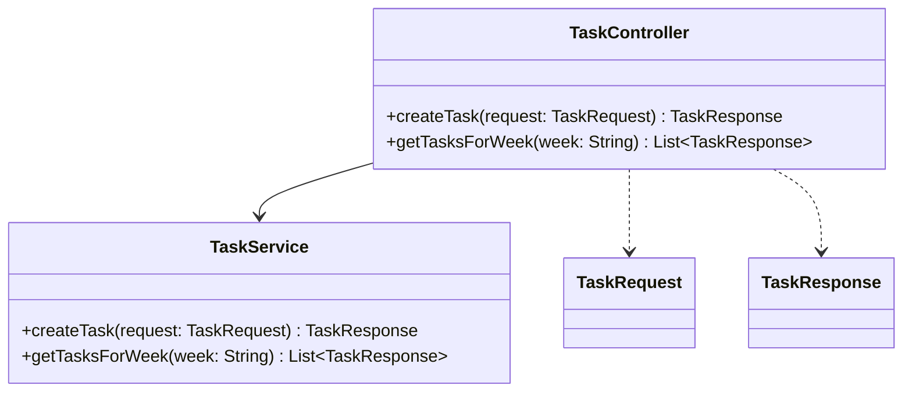
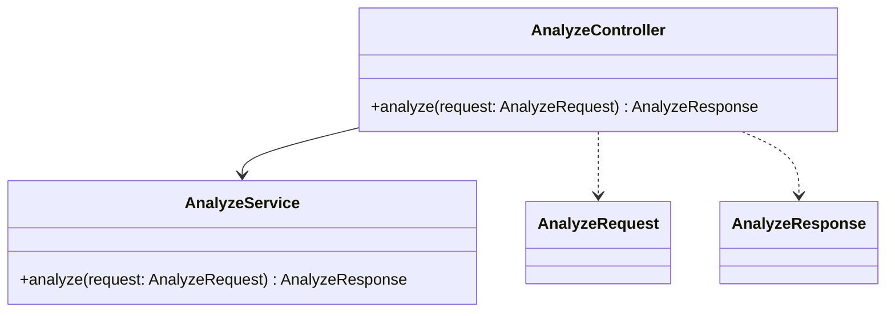
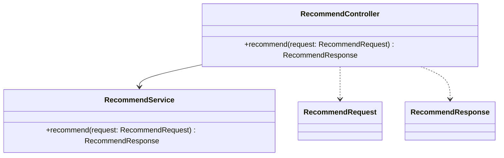
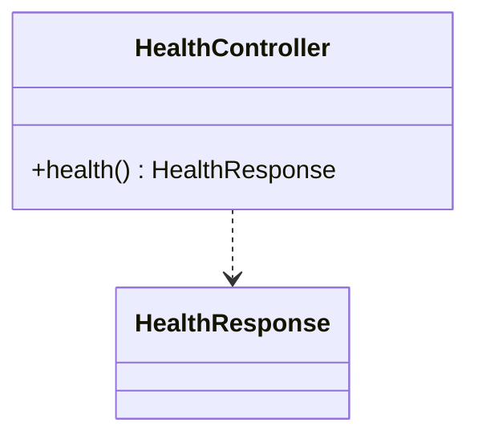
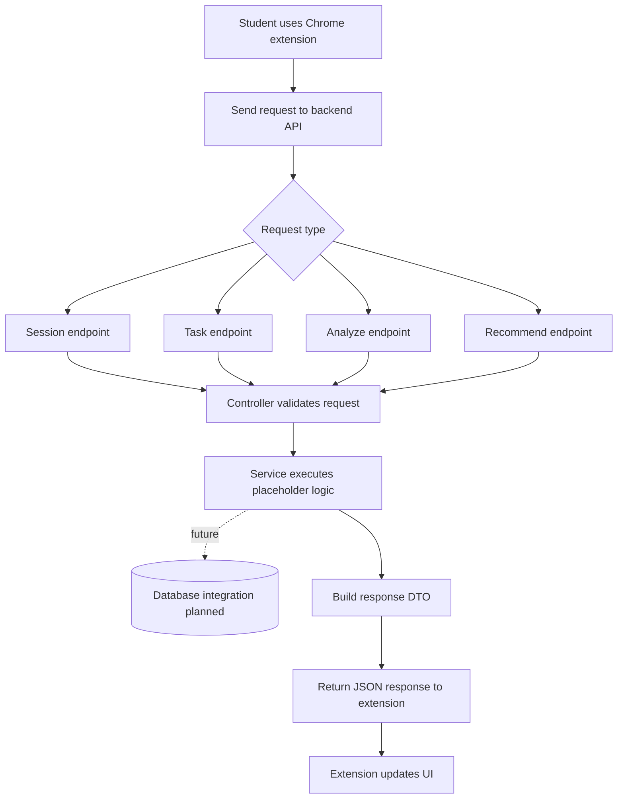
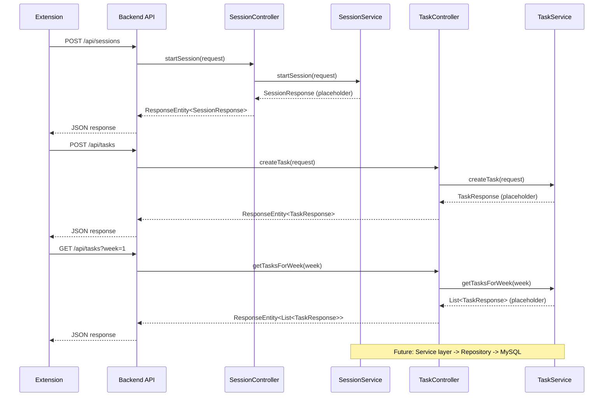

<!--# Specification Document

Please fill out this document to reflect your team's project. This is a living document and will need to be updated regularly. You may also remove any section to its own document (e.g. a separate standards and conventions document), however you must keep the header and provide a link to that other document under the header.

Also, be sure to check out the Wiki for information on how to maintain your team's requirements. -->

## Oil on Canvas

### Project Abstract

We'll build a browser extension that provides features for Canvas users, particularly students. Our main goal is to make Canvas easier to use for students by better organizing canvas assignments, providing a task manager, and generally improving Canvas UX for students. The part I focus more on is the Canvas OAUTH implementation, backend testing and database testing.

<!--A one paragraph summary of what the software will do.-->

<!-- This is an example paragraph written in markdown. You can use *italics*, **bold**, and other formatting options. You can also <u>use inline html</u> to format your text. The example sections included in this document are not necessarily all the sections you will want, and it is possible that you won't use all the one's provided. It is your responsibility to create a document that adequately conveys all the information about your project specifications and requirements. -->

<!-- ### Customer

Customer for this software will be students who use Canvas for their coursework.

Dylan Zinsley will act as our customer on the CS506 instructional staff. -->

<!--A brief description of the customer for this software, both in general (the population who might eventually use such a system) and specifically for this document (the customer(s) who informed this document). Every project will have a customer from the CS506 instructional staff. Requirements should not be derived simply from discussion among team members. Ideally your customer should not only talk to you about requirements but also be excited later in the semester to use the system.-->

### Specification

<!--A detailed specification of the system. UML, or other diagrams, such as finite automata, or other appropriate specification formalisms, are encouraged over natural language.-->

<!--Include sections, for example, illustrating the database architecture (with, for example, an ERD).-->

<!--Included below are some sample diagrams, including some example tech stack diagrams.-->

#### Technology Stack

[Frontend](apps/chrome-extension/README.md)
[Backend](apps/backend/README.md)

**Documentation:** [Backend implementation summary](docs/BACKEND_IMPLEMENTATION.md) · [Frontend API guide](docs/FRONTEND_API_GUIDE.md) · [Canvas Assistant flow](docs/CANVAS_ASSISTANT_FLOW.md) · [Canvas API guide](docs/CANVAS_API_GUIDE.md)

#### Database

Current status: MySQL integration is planned, but not implemented in the running backend yet (`db/init.sql` is currently a placeholder).

**Planned tables:**

- **ooc_user** | Unique IDs for each OOC user
- **canvas_instance** | Base URLs for different schools
- **canvas_connection** | Map OOC users to canvas accounts auth credentials
- **course_cache** | User enrolled courses (cached)
- **assignment_cache** | Assignment data (cached)
- **assignment_additions** | Generated suggestions and information for assignments
- **todo_item** | Upcoming and overdue assignments

#### Class Diagram

#### Flowchart

#### Behavior

- **Session Management:** Extension can call `/api/sessions`; current response is a placeholder DTO.
- **Task Management:** Extension can call `/api/tasks` (POST/GET); current responses are placeholder DTO(s).
- **Content Analysis:** Extension can call `/api/analyze`; current response is a placeholder DTO.
- **Recommendations:** Extension can call `/api/recommend`; current response is a placeholder DTO.
- **Current implementation note:** Business logic and persistence are planned; database integration is not implemented yet.

#### Sequence Diagram

### Standards & Conventions

<!--This is a link to a seperate coding conventions document / style guide-->

[Style Guide & Conventions](STYLE.md)
